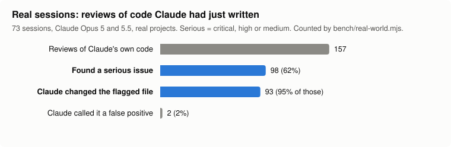
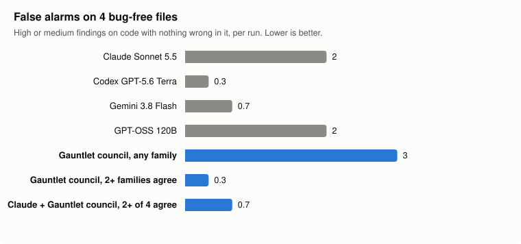
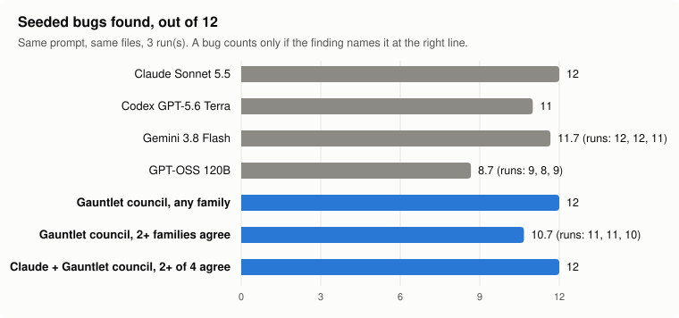
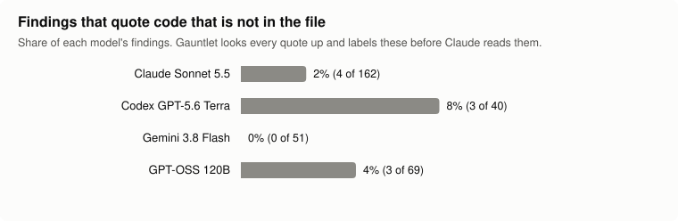

<div align="center">

# Gauntlet

Make Claude's code run the gauntlet.

Codex, Gemini and GPT-OSS review what Claude Code writes. Every finding has to quote the
line it's about, and Gauntlet checks that quote against your files before Claude reads it.
It runs on the ChatGPT and Google plans you already pay for. No API keys.

**In 157 real reviews of code Claude Opus had just written, another model family found a
serious issue 62% of the time, and Claude went on to change the flagged file in 95% of those
cases.** [How that was measured](#does-it-actually-help)

[](https://github.com/Raffymimii/gauntlet/actions/workflows/ci.yml)


</div>

---

## Why I built this

I do most of my coding with Claude Code, and I kept hitting the same two walls.

The first: asking Claude to review its own code mostly gets you Claude agreeing with
itself. The bug it didn't see while writing, it doesn't see while reviewing.

The second came when I started asking other models instead. They found real bugs, and
they also made some up. A confident paragraph about a race condition on line 84, and line
84 is a comment. I'd lose half an hour finding that out.

Gauntlet is what I ended up with. Claude still writes the code and is still the only thing
allowed to touch my files. When a change matters, it sends a small packet (the objective,
the files, the diff) to a model from a different family and gets a structured review back.
Before Claude sees that review, Gauntlet looks up every quoted line in the real file and
sorts the findings into three groups:
- verified;
- nothing to check against a file;
- "could not be confirmed", meaning the quoted code isn't there.

Here's a real run, Gauntlet reviewing its own JSON parser with two families:

```text
# Council (review): 2/2 voices answered

## Verdicts
- codex (gpt-5.6-terra): approve, confidence high
- gemini (gemini-3.8-flash-high): approve_with_changes, confidence high

Disagreement: approve vs approve_with_changes. Resolve it with evidence, not by averaging.

## gemini
[gemini / gemini-3.8-flash-high, advisory and read-only: tier standard, 108.4s,
 2/2 claims verified against the files]

## Findings verified against the files (2)
1. [medium] src/json.mjs:32: extractJson aborts on the first unclosed opening brace,
   failing to extract subsequent valid JSON objects.
   Fix: Replace `break;` with `continue;` ...
2. [low] src/json.mjs:28: extractJson returns arrays when the input is a standalone
   JSON array ...
```

Codex approved the file. Gemini found two real bugs, both quoted from the source, and both
got fixed in the next commit. That's the whole idea in one screen.

## What's in it

- An MCP server with ten tools: reviews, a diagnosis tool, plan critique, a security
  audit, edge cases, and `council`, which asks Codex, Gemini and GPT-OSS the same question
  at once and tells you where they agree. Findings that two families reached on their own
  are the ones I trust most.
- A fallback chain, because quotas run out. If the flagship model is rate-limited, the
  call goes to the smaller model of the same family, then to another family, then to
  Claude through Antigravity. A model that just failed sits out for a while, so the next
  call doesn't wait on it again.
- Four read-only Claude subagents (`haiku-navigator`, `sonnet-reviewer`, `opus-architect`,
  and `sonnet-test-analyst`, which is opt-in) for when you'd rather stay in the Claude
  family.
- Optional hooks:
  - a pre-turn hook that runs a small pipeline of internal agents (comprehension,
    anti-hallucination, text review, jury, legal, learning);
  - a gate that refuses `git push` while edited code hasn't had a review.

The pipeline config is versioned. Publish a new version and chats that are already open
pick it up on their next message, without a restart. It's the part I'm proudest of,
and the one I'd point a curious engineer at first. See
[architecture](docs/architecture.md).

## Does it actually help?

I use Claude Opus every day, and I wanted to know whether the second opinions were worth
the wait. There are two ways to measure it, and the answers differ in an interesting way.

### On real work

Claude Code keeps every session on disk. [`bench/real-world.mjs`](bench/real-world.mjs)
reads those transcripts and, for each review, checks three things:
- was the reviewed code Claude's own, written earlier in that same session;
- did the review raise a serious issue (critical, high or medium);
- what did Claude do next: edit a file the finding named, or call it a false positive.

I ran it on three weeks of my own sessions on two machines: 73 sessions, Claude Opus 5 and
5.5, real projects.

<picture>
  <source media="(prefers-color-scheme: dark)" srcset="docs/bench/real-world-dark.svg">
  
</picture>

In 157 reviews of code Claude had just written and was ready to move on from, another
model family found a serious issue **62% of the time**. Claude then edited the file the
finding named in 95% of those cases, and dismissed 2 of 98 as false positives.

That matches what using it feels like. I've almost stopped reporting bugs to Claude myself.
What's left are misunderstandings about what I asked for, not mistakes in the code.

The method has limits, and you should know them:
- "Edited the flagged file" means Claude changed a file the finding named, after the
  review and before the next one. That's a strong sign the finding was accepted, but it
  doesn't prove each edit fixed exactly that finding.
- The data is from one developer's sessions.

The script is in the repo, so run it on your own history and see what you get:

```bash
node bench/real-world.mjs ~/.claude/projects
```

### A controlled benchmark

I also wanted a test anyone can rerun, so I planted bugs in 16 code samples and gave the
same files to four reviewers, three times each: 192 reviews.

Twelve samples have one bug I put there on purpose, and they're not textbook ones:
- an LRU cache that never refreshes recency;
- a semaphore that leaks a permit on cache hits;
- cents passed to an API that expects euros, across two files;
- a token bucket that refills in milliseconds instead of seconds;
- an Express route registered before its auth middleware;
- a booking race;
- a ReDoS-prone regex;
- and five more.

The other four files are correct. Three model families checked them and found nothing, and
they're there to count false alarms. A bug only counts as found when the finding points at
the right lines **and** names the actual problem. The method, the corpus and the raw answers
are in [docs/benchmark.md](docs/benchmark.md).

<picture>
  <source media="(prefers-color-scheme: dark)" srcset="docs/bench/false-alarms-dark.svg">
  
</picture>

<picture>
  <source media="(prefers-color-scheme: dark)" srcset="docs/bench/bugs-found-dark.svg">
  
</picture>

What the controlled test shows, and why it differs from the real sessions:

- **Here Claude found every planted bug on its own.** These bugs were written by me, in
  short self-contained files, and Claude was asked to look for them. That is the easy case.
  On real work, Claude is reviewing code it wrote itself, minutes earlier, in the middle of
  a long task, convinced it's right. That's where the 62% above comes from, and no
  synthetic test I can build reproduces it well.
- **The council cuts the noise.** Claude alone raised 2 false alarms per run on code with
  nothing wrong in it. Keep only what at least two of four families agree on, and you still
  get 12 of 12 bugs with 0.7 false alarms per run.
- **Each reviewer has fixed blind spots.** Codex missed the ReDoS in all three runs, and
  GPT-OSS missed the mutable default argument every time. A different family covers them.
- **Made-up findings are rare but real.** 2-8% of the findings from Claude, Codex and
  GPT-OSS quoted code that isn't in the file. Gemini had none. Gauntlet looks up every
  quote and labels those before Claude reads them:

<picture>
  <source media="(prefers-color-scheme: dark)" srcset="docs/bench/made-up-dark.svg">
  
</picture>

| Reviewer | Bugs found (of 12) | False alarms / run | Median time per review |
|---|---|---|---|
| Claude Sonnet 5.5 (alone) | 12 | 2.0 | 12 s |
| Codex GPT-5.6 Terra | 11 | 0.3 | 10 s |
| Gemini 3.8 Flash | 11.7 | 0.7 | 73 s |
| GPT-OSS 120B | 8.7 | 2.0 | 86 s |
| Gauntlet council (any family) | 12 | 3.0 | 107 s |
| Gauntlet council (2+ families agree) | 10.7 | 0.3 | 107 s |
| **Claude + Gauntlet council (2+ of 4 agree)** | **12** | **0.7** | 107 s |

Some caveats:
- Sixteen samples is small.
- I wrote the bugs.
- The models change week to week.
- The council's time is its slowest voice, because the families run in parallel.
- GPT-OSS didn't answer 6 of its 48 reviews; those count as misses, not as somebody
  else's answer.

There's also an [easy set](docs/benchmark.md#the-easy-set) of textbook bugs, where every
frontier model scores 12 of 12. That's why the set above exists.

A word on tokens. Gauntlet doesn't make reviews free. It moves them off your Claude plan and
keeps the packets small: a median review above cost between 9k and 26k tokens on the other
provider's side, depending on the model, and none on Claude's. [docs/token-savings.md](docs/token-savings.md)
explains where the savings come from and how to measure them on your own work.

## Installing

### 1. What you need

- Node.js 20 or newer (`node --version`).
- [Claude Code](https://docs.claude.com/en/docs/claude-code), with the `claude` command
  working in your terminal.
- At least one of the two provider CLIs below. You don't need both; Gauntlet uses
  whatever is installed.

### 2. The provider CLIs

Codex, using your ChatGPT plan:

```bash
npm install -g @openai/codex
codex login        # sign in with your ChatGPT account
```

Antigravity, using your Google account. This is the one that gives you Gemini, GPT-OSS
and the Claude fallback lane. Install Google's Antigravity CLI (`agy`) by following
Google's instructions for your OS, then run it once so it can sign you in:

```bash
agy
```

### 3. Gauntlet itself

```bash
git clone https://github.com/Raffymimii/gauntlet.git
cd gauntlet
npm install
node bin/gauntlet.mjs init --dry-run    # prints every change, touches nothing
node bin/gauntlet.mjs init
```

What `init` does by default:
- registers the MCP server with `claude mcp add --scope user gauntlet ...`;
- copies the read-only subagents into `~/.claude/agents`.

Without a flag it doesn't touch your `settings.json` or your `CLAUDE.md`. These are the
opt-ins:

```bash
node bin/gauntlet.mjs init --claude-md        # adds one @-include line to ~/.claude/CLAUDE.md
node bin/gauntlet.mjs init --hooks turn       # pre-turn hook: live config + internal agents
node bin/gauntlet.mjs init --hooks review-gate
node bin/gauntlet.mjs init --test-analyst     # the subagent that runs your tests
```

I'd recommend `--claude-md`. It's the file that tells Claude when a quick check is enough
and when to call the council. Without it, Claude only uses the tools when you ask.

If you want a plain `gauntlet` command instead of `node bin/gauntlet.mjs`, run `npm link`
inside the folder.

### 4. Check it

```bash
node bin/gauntlet.mjs status
```

You should see your CLIs as installed and signed in, the model for each tier, and no
paused models. Then **open a new Claude Code chat** (MCP servers are only loaded when a chat
starts) and try:

> get a quick_check of src/whatever.ts: is the retry loop bounded?

> run a council on this diff before I push it

### 5. Removing it

```bash
node bin/gauntlet.mjs uninstall
```

This removes the MCP server, the subagents it installed, its hook entries and its
`CLAUDE.md` line, and nothing else. Your data in `~/.gauntlet` stays until you delete it.

## When something doesn't work

| Symptom | Likely cause |
|---|---|
| Claude doesn't see the `gauntlet` tools | You're in a chat opened before `init`. Open a new one. `claude mcp list` should show `gauntlet`. |
| `status` says a CLI is not signed in | Run `codex login`, or run `agy` once interactively. |
| "model not available" errors | Providers rename models. Put the current names in `~/.gauntlet/config.json` (see [configuration](docs/configuration.md)). |
| A review times out | The packet is too big, or the tier too high. Name fewer files, or ask for `tier: "light"`. |
| A model is "paused" | It failed on quota or login recently. It comes back by itself. `status` shows how long. |
| `agy` isn't found by the MCP server | Set `providers.antigravity.command` to the full path of the executable. |

## Safety

The reviewers are read-only:
- Codex runs in its read-only sandbox, and Antigravity in plan mode with its sandbox on;
- both have a hard timeout and a scrubbed environment;
- the prompt goes in on stdin, never on the command line;
- a reviewer can't call another reviewer.

What leaves your machine is the packet, and only the files you name. Gauntlet refuses:
- `.env` files and keys;
- anything under `.ssh`, `.aws` or `.git`;
- symlinks that lead outside the project;
- binaries.

It also redacts token-shaped strings. `gauntlet packet` shows you exactly what would be
sent, without sending it.

What you send to OpenAI or Google is covered by your own agreement with them, and checking
that your use fits your plans' terms is on you. Gauntlet uses the official CLIs under
your account and backs off when a provider says you're out of quota.

The full picture is in [docs/security.md](docs/security.md), including what it doesn't
protect against.

## FAQ

**Does it cost anything per token?** No. It uses your existing logins through the
official CLIs.

**Can a reviewer change my code?** No. Reviewers only answer; Claude decides what to apply.

**Why not just ask Claude to review its own work?** Sometimes that's fine. But another
family catches different things. And a reviewer whose quotes get checked against the file
can't send you after a bug that doesn't exist.

**Will this work with my model names?** The defaults are what I use. When yours differ,
`~/.gauntlet/config.json` overrides any of them.

## Contributing

Issues and PRs welcome. If you touch a prompt in `prompts/`, run the agent regressions
(`node bin/gauntlet.mjs regress`) and paste the result in the PR. If you measure the token
savings on real work, I'd love to see the numbers, along with how you measured them.

## License

MIT
